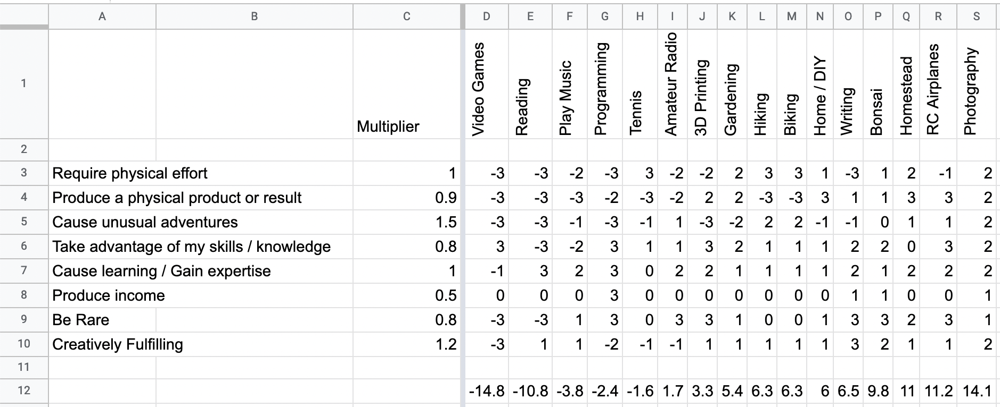

In a quote that I can neither exactly remember nor find, in which some terribly heretical 19th-century socialist extolls the absurdity of limiting a work day to 8 hours, they also comment on the remaining 8 hours of leisure, rest, and relaxation time that each man has available at the end of the workday, and before the biologically required 8 hours of sleep.  The main point is that every man is free to conduct himself exactly like the wealthy for those 8 hours.  No matter the man's station at work, or the fact that he must work at all to provide for his family, in those remaining 8 hours, equality is governed by self-directed purpose.  He might study the fine arts of literature and painting, attend the theater, or study philosophy.  In the "other 8" hours, there is no limit to the type of self-improvement a man is allowed to undertake.

Having achieved some amount of success in my chosen craft of software engineering, it becomes possible to commit less personal time to career advancement, and more time to a leisure pursit.  Ideally, this non-work focused craft is a source of both interest and mental rejuvination that supports my career in it's contrast to it.  

In order to achieve that, I believe it necessary to achieve a high level of expertise. And in order to achieve high expertise, I believe it necessary to focus effort on fewer activities.  Depth and breadth of expertise are inversely proportional; a man's time and attention are both finite resources so depth and breadth can only be traded, not increased in total.  For someone who enjoys the learning process and gathering knowledge about all parts of the universe, an obvious problem arises: what singular pursuit is worthy of such attention?

Of course, the right way to solve such an emotional and personal commitment is with a spreadsheet.

And before it's possible to create a menaningful spreadsheet, it's of course necessary to invent a framework and measurement system.

For illustration, we start now with the completed result:

I first made a list of the most interesting hobbies that I've previously expolored (columns), and that I could reasonably imagine centering all further interests upon.  Next, another list was made of all the properties that I'm personally looking for in an ideal activity (rows).  The critical piece of the calculation is then weighting each property by it's importance to me (multiplier).  I picked a single property to define as weight `1` of importance, in this case physical activity because it's the most different property possible from my day job at a desk.  Which property is chosen as `1` doesn't really matter, but then all other properties are evaluated relative to it, so ideally a property of medium importance makes for the easiest comparisons. 

Each hobby must then be scored against this framework.  I firmly believe that most rating systems are highly ineffective: 0-100 is far too large of a scale, and ratings tend to clump irregularly towards the top; getting someone to review something "just below average" as 45 points is fairly unheard of.  Same with 1-10.  1-5 (usually stars) is much more human-sized, but still suffers from skewed averages - giving anything less than a 5-star rating is to demolish it's existence in our review-crazed curation culture.  So I developed what I consider to be the correct, human-sized rating scale that I will attempt to refine in all scenarios going forward.  The scale goes from "very negative high impact", to "no effect", to "very positive high impact".

